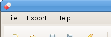
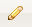

===============
Profiler4j Fork
===============

Profiler4j Fork is, intuitively clear, a fork of the `original Profiler4j <http://profiler4j.sourceforge.net/>`_. I've begun it to enhance this already very useful and handy tool by Antonio S. R. Gomes.

The project is now finished, since all issues, which I wanted to add, have been added. For more information, please see the documentation below.

.. contents:: Table of Contents

License
#######

As the original project, the fork is available under a `APACHE LICENSE v2.0 <http://www.apache.org/licenses/LICENSE-2.0.txt>`_

Download
########

Both the source code and the binaries of the fork are available from the `download section <http://github.com/jmc7479/profiler4j/downloads>`_ of the `project page <http://github.com/jmc7479/profiler4j>`_ at `github <http://github.com/>`_.

For the downloads of the original project, see `its download section <http://sourceforge.net/projects/profiler4j/files/profiler4j/>`_.

Changes
#######
Where changes have been made during the fork project in respect to the original:

- Obviously, lots of changes in the Java Code.
- Added a few tips to explain the new features.
- Added libraries:

  - Apache Commons library "lang" in version 2.4, http://commons.apache.org/lang/

    - only needed by the console

  - XStream 1.3.1, http://xstream.codehaus.org/

    - needed by both the console and the agent to dump snapshots

Documentation
#############

Here, all features that have been added in the forked program, are documented.

For information on how to use the profiler and on any of the original features, please see the `official Profiler4j page <http://profiler4j.sourceforge.net/>`_ at sourceforge.

Call Graph
**********

In the call graph, you can select a node and spread this direction either upwards or downwards the call chain. Also, the call graph can now be easily exported to a PNG image file. This can happen manually, or automatically on each snapshot.

Spread selections
-----------------
Starting from a given method, you can follow down (or up) its call chain in order to see which method are called indirectly.

To do this, select a node in the call graph by clicking on it.

.. image:: images/selection-1.png

Then, press **[shift] + [right-arrow]** together. Now all nodes that represent methods that have been called by the selected one, are also selected.

.. image:: images/selection-2.png

Repeat this, until the entire call stack has been selected. Shortcut: Press **[shift] + [End]**

.. image:: images/selection-end.png

This also works in the other direction with **[shift] + [left-arrow]** and **[shift] + [Pos1]** respectively.

Export to file
--------------
To export the currently shown call graph, note the new "Export" menu.

Simply select its "Call graph..." entry, choose where to save the image and confirm. Done.

Export automatically
--------------------
You can also export the call graph each time you take a snapshot. Note, that in this case, the image will always reflect the call graph at its maximum level of detail.

To enable this feature, open the project details using the pen button |pen| in the button bar. In the section "Automatic Export", make sure the checkbox is checked.

.. image:: images/project-details.png

Then, you may specify a filename pattern, which determines to which file the call graph is saved each time a snapshot is taken (see below). Confirm with "Ok" and be done. There is no need to apply the rules for the export feature to take effect, since the rules haven't changed. Now, each time you press the snapshot button, the call graph is exported.

For the pattern are two possibilities here. If you are only interested in the *most recent* picture, you can simply specify a full path to a file, either existing or not. For example, "/home/joe/latest.p4j-snapshot" would do.

On the other hand, if you want to inspect *every* of the exported call graphs, then in addition to the full path you must use the place holder token "%i" in the file name. Each time a snapshot is taken, the place holder is substituted with the next higher number. For example, using the pattern "/home/joe/callgraph-%i.png", the generated filenames would be "callgraph-1.png", "callgraph-2.png" and so on.

Note that the place holder always starts at the highest used number. So, in the previous example, if there had been a file "callgraph-82.png", then the next file would be named "callgraph-83.png".

Copy to clipboard
-----------------
You can also export the current call graph to the clip board. For this, simply use the "Copy" button at the top-right corner of the call graph view. Again, the call graph is exported in the PNG image format.

Snapshot
********
Snapshots can now be loaded and saved. Additionally, the agent can be configured to dump a snapshot right before the application closes down.

Load/Save
---------

In order to save the currently taken snapshot, or in order to load a previous one, simply use the corresponding items in the "File" menu.

Save on Exit
------------
The agent can be configured to save the current snapshot to disk right before exiting. This is particularly helpful for a number of reasons:

- You can reset the statistics before exiting and profile only the *shut down process* of your application. (If you're interested in it.)
- Since the application might be closing down real fast, there is no clever way to time this manually.
- One might want to profile not only a particular situation, but a complete session. In this case, the option helps since you don't forget to take a snapshot. :)

In order to enable this feature, add the "snapshotOnExit" argument to the agent's parameters. For example, let's assume your javaagent argument to your profiled application looked like this:

``-javaagent:"/home/joe/profiler4j-fork-1.0/agent.jar"``

It now must look like so:

``-javaagent:"/home/joe/profiler4j-fork-1.0/agent.jar"=snapshotOnExit``

By default, the snapshot gets exported in your user's home directory to a file named "snapshotOnExit.p4j-snapshot". If you want to specify a different file, do so by adding the path as an argument to the option:

``-javaagent:"/home/joe/profiler4j-fork-1.0/agent.jar"=snapshotOnExit=/home/joe/on-exit.p4j-snapshot``

A snapshot dumped this way, can be opened as any other.

.. |date| date::

Last updated: |date|.
